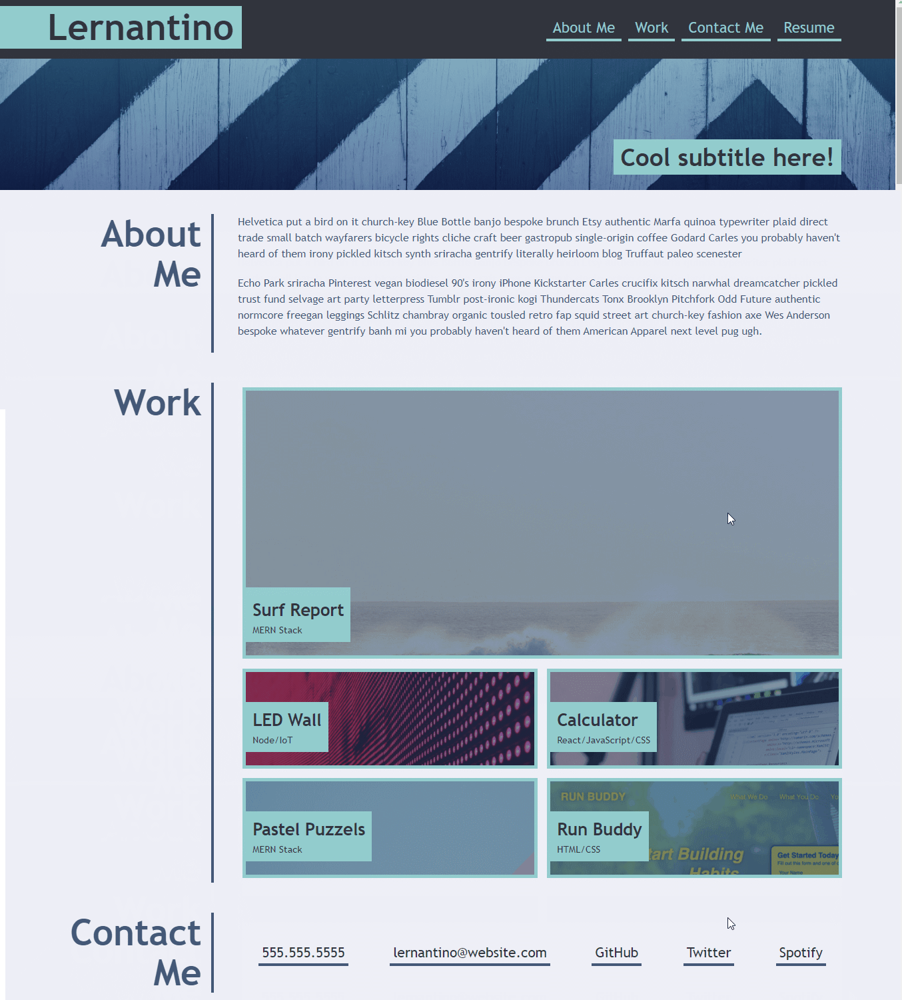
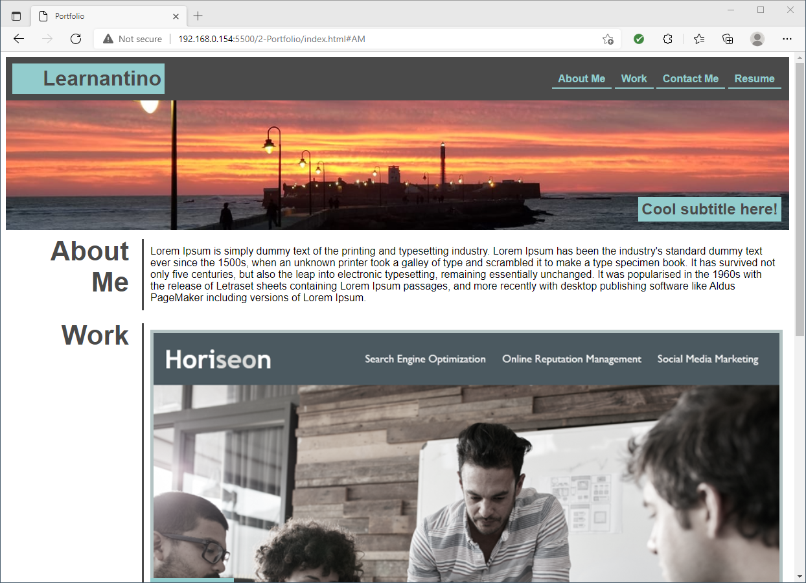

# Assignment 2-Portfolio

    Created website to look as close to the given image, save for the pictures that I've had to replace. I used both position, grids, and flex boxes in this assignment. I nested a grid in the second row second column of the first grid.
    

* [Github repo](https://github.com/MJGRiley/2-Portfolio)
* [Github pages](https://MJGRiley.github.io/2-Portfolio/)

Mockup given:

My Thumbnail:

